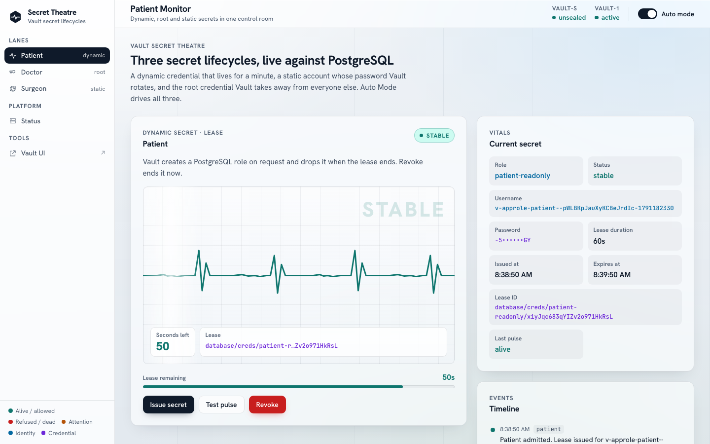

# Vault Secret Theatre



Three Vault secret lifecycles, live against PostgreSQL, on one screen. The
whole stack (two Vault nodes, PostgreSQL, a Vault Agent, the API and the UI)
runs on Podman and builds itself from zero with `make`. Terraform owns all
Vault configuration.

## What the demo shows

**Patient: a dynamic secret.** Every *Issue secret* asks Vault for a brand-new
PostgreSQL role (`database/creds/patient-readonly`) with a 60-second lease.
The monitor counts down, the pulse check logs in with it every 5 seconds,
and when the lease ends (or *Revoke* ends it, `sys/leases/revoke`) Vault drops
the role and the trace flatlines.

**Surgeon: a static role.** `surgeon_svc` exists in PostgreSQL; Vault owns its
password and rotates it every 120 seconds (`database/static-creds/surgeon`).
*Rotate role* (`database/rotate-role/surgeon`) rotates it now: the old
password stops working and the new one works.

**Doctor: root rotation.** *Rotate DB root*
(`database/rotate-root/hospital-postgres`) changes the password of Vault's
own database account, `vault_mgmt`. Afterwards only Vault knows it, and every
lane keeps working. `vault_mgmt` is not the PostgreSQL superuser, so this is
safe to press as often as you like.

**Auto Mode** drives all three lanes on timers. The *Platform* panel and the
top bar show the seal node, Vault, PostgreSQL and the API's own identity.

## Architecture

```text
            browser ──► srot-web (nginx :13001) ──/api──► srot-api (Express)
                                                            │  reads token file
                                                            ▼
 srot-vault-agent ──AppRole login──► srot-vault-1 ◄──── token sink (volume)
                                      │  seal "transit"      │ database engine
                                      ▼                      ▼
                                srot-vault-s           srot-postgres
                          (Shamir 1-of-1, Transit       (hospital: vault_mgmt,
                           key `autounseal`)             surgeon_svc, v-* roles)
```

- **vault-s** holds the Transit key. It is the one node anyone unseals;
  `make up` does it for you from `.secrets/vault/seal-init.json`.
- **vault-1** auto-unseals through vault-s. Every listener is TLS 1.3 with a
  lab CA (`make gen-certs`); nothing skips verification.
- **The API holds no token, and nobody holds its secret-id.** See below.
- Each stack is its own Compose project: `seal`, `vault`, `data`, `app`. See
  [compose/README.md](compose/README.md) for what persists where.

## Machine identities: rotator + agent, on both planes

Both machine credentials in the stack heal themselves, the way Project
Durin's do: the **API's** Vault identity on vault-1, and the **seal token**
vault-1 needs to unseal through vault-s.

```text
 make rotator-bootstrap ──► .secrets/vault/rotator/   the app plane's ONE handed-over credential
                                   │
                              srot-rotator  (policy: manage the API role's secret-ids, nothing else)
                                   │ issues / rotates / destroys
                                   ▼
                     approle-api volume: role-id, secret-id (90 days), metadata
                                   │
                            srot-vault-agent  (AppRole login, watchdog)
                                   │ token file, 15 min, renewed
                                   ▼
                               srot-api   reads the file on every request
```

- **The rotator decides on Vault's answer.** Every 60s it asks Vault about the
  secret-id on disk and replaces it when Vault no longer knows it or less
  than a third of its real life is left. Each rotation issues one secret-id
  and destroys the one it replaced.
- **The `auth/approle` mount is tuned to 90 days.** vault-1's maximum lease
  is 24h, and AppRole silently caps secret-ids at the mount maximum: the bug
  that broke Durin. `make verify` checks the real lifetime.
- **The agent has a watchdog.** When Vault rejects its token it exits, and
  `restart: on-failure` logs it in again with whatever secret-id is current.
  The API is never restarted.

The **seal plane** is the same chain on vault-s: `srot-seal-rotator` keeps
the `seal-autounseal` secret-id valid, `srot-seal-agent` keeps a periodic
Transit token in the `seal-token` volume, and vault-1 reads it at start.
`scripts/vault-server.sh` checks the agent's token against vault-s first and
falls back to the bootstrap token only when vault-s rejects it, so a dead
token never crash-loops vault-1. The token is read once per start: a revoked
one leaves vault-1 running but unable to restart unsealed, which
`make seal-token-status` (and `make doctor`) catch; `make vault-recreate`
moves vault-1 onto the agent's fresh token.

`make rotation-test` proves it: a revoked API token, a forced rotation, a
destroyed secret-id *and* revoked token together (healed in about a minute,
no human), a destroyed rotator credential (`make agents-recover`), and the
seal token vault-1 runs on revoked (`make vault-recreate`).

## Quick start

Requires Podman (with `podman compose`), `vault`, `terraform`, `jq`,
`openssl`, `curl`. Nothing else needs to run first.

```bash
make env-init     # creates .env with a generated PostgreSQL superuser password
make bootstrap    # certs → Vault → PostgreSQL → Terraform → app → verify (~1 minute)
```

Open <http://127.0.0.1:13001>.

## Daily use

```bash
make up           # cold start: vault-s, unseal, vault-1, PostgreSQL, app
make down         # stop everything; containers and volumes are kept
make verify       # 53 end-to-end checks, including all three lanes over HTTP
make doctor       # what is wrong and which target fixes it (read-only)
make help         # every target, grouped
```

| Target | What it does |
| --- | --- |
| `make unseal` | Unseal vault-s (vault-1 then unseals itself) |
| `make vault-status` | Both nodes: init, seal type, HA role, Raft index |
| `make vault-login` | Prints the `export` line for your `vault` CLI |
| `make tf-plan-all` | Both Terraform roots; must say "No changes." |
| `make db-test` | Issue, use and revoke a credential from the CLI |
| `make db-rotate-root` | Rotate `vault_mgmt`'s password (the Doctor lane) |
| `make agents-status` | Both planes: rotator, secret-id expiry, last rotation, agent token TTL, vault-1's seal token |
| `make seal-token-status` | Is the seal token the running vault-1 holds still valid, and where is it from? |
| `make rotate-now [ROLE=seal]` | Rotate the API (or seal) identity's secret-id now |
| `make rotation-test` | Break the identity four ways and watch it heal (changes state) |
| `make agents-recover` | The one manual repair: re-deliver the rotator's credential |
| `make app-rebuild` | Rebuild and restart the API and UI after editing `app/` |
| `make backup` | Raft snapshots of both nodes, `pg_dump`, `.secrets` → `backups/` |
| `make clean-slate` | Remove containers and volumes (backup first, type DELETE) |
| `make clock-sync` | Step the Podman VM clock back to the Mac's |

## Configuration

`config/defaults.env` (tracked) holds image pins, host ports and names;
`.env` (not tracked) overrides any of them and holds the passwords.

| Port | Service |
| --- | --- |
| 13001 | UI (nginx; `/api` proxied) |
| 13000 | API |
| 18200 | vault-1 (`/ui` is the Vault UI) |
| 18190 | vault-s |
| 15432 | PostgreSQL |

The ports were chosen to run beside `vault_reference`. Vault Community is the
default; set `VAULT_IMAGE` and `VAULT_LICENSE` in `.env` for Enterprise.

Secrets never live in tracked files. Init material, the Transit token,
AppRole credentials, Terraform state and the lab CA are in `.secrets/`
(gitignored, mode 0600). Using root tokens for bootstrap and Terraform is a
lab shortcut, and the scripts say so where they do it.

## Developing the UI

```bash
make up                       # the API and Vault run in Podman
cd app/web && npm install && npm run dev    # Vite on :5173, /api proxied to :13000
```

The UI follows [DESIGN.md](DESIGN.md): daylight ground, colour only for
state, Vault's answer verbatim.

## Troubleshooting

| Symptom | Cause | Fix |
| --- | --- | --- |
| Leases look expired the moment they are issued; tokens fail | The Podman VM clock drifted (it pauses with the Mac) | `make clock-sync` |
| vault-1 restarts in a loop, log says `error parsing Seal configuration` | vault-s is down or sealed | `make vault-up` |
| `make vault-bootstrap` stops: "saved credentials but no storage" | A volume was lost; the init file is from the old one | Restore from `backups/`, or `make clean-slate` |
| Lanes fail with "permission denied" for a minute | The agent's token or secret-id died; it is healing | Wait, or `make agents-status` |
| `make doctor`: "the rotator's own credential is rejected" | Its secret-id was destroyed | `make agents-recover` |
| `make doctor`: "vault-1's seal token REJECTED" | The Transit token vault-1 started with was revoked | `make vault-recreate` |
| `make doctor`: "mounts a path that no longer exists" | A mounted file moved; the container cannot restart | `make up` |
| A port is taken | Another project holds it | `make ports-check`, override in `.env` |

## Repository

```text
app/api, app/web     the API (Express 5) and UI (React 19 + Vite)
compose/<stack>/     one Compose project per stack
config/defaults.env  pins, ports, names
scripts/             what the make targets run (bash)
terraform/           vault-platform (AppRole, policy), vault-database (engine, roles)
vault/               server configs and policies
postgres/init/       schema and the two accounts Vault works with
prompts/podman/      the prompts that built this layout
docs/STATE.md        what each prompt did, and what was learned
```

## License

[GPLv3](LICENSE)
